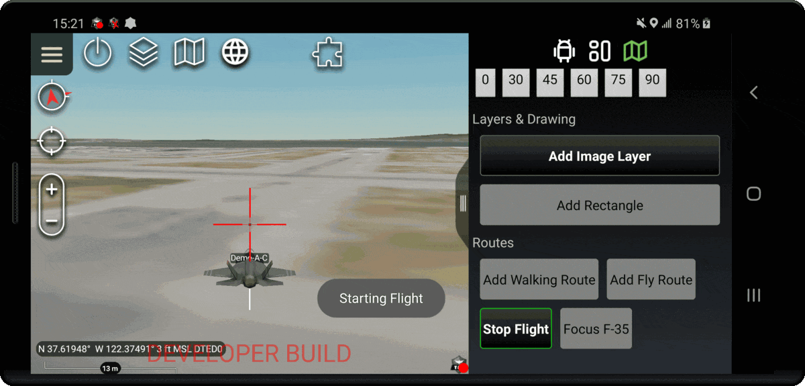

# Demo Hello World Plugin  

This plugin was developed to showcase how to use common Android components within an ATAK plugin and provide examples of ATAK API methods. The goal of this plugin is to be a well documented resource of "how-to" guides for implementing commonly desired application capabilities. When loaded, the plugin can be found in the ATAK [tools](../website/content/docs/atak_development/atak_quick_reference.md/#toolbar--toolbar-items) as a mesh globe icon .
The plugin pane is organized into 3 major categories denoted by the following tab icons: 

- [Core Components](../website/content/docs/example_plugins/demo-hello-world/core_components.md): Buttons, Text Views, Image Views, Notifications, Services, Resources, Threads
- [Layouts](../website/content/docs/example_plugins/demo-hello-world/layouts.md): Relative Layout, Constraint Layout, Linear Layout, Recycler View, Grid View, Plugin Pane
- [Mapping](../website/content/docs/example_plugins/demo-hello-world/mapping.md): Markers, Icons, Zoom, Tilt, Cursor-On-Target (CoT), Layers, 3D Models, Routes, Navigation




*We suggest exploring each tab from left to right building from the core components to the ATAK mapping specifics. If there are any ATAK API features that you find and believe would be common use for plugin developers please open an issue to make a request for an example to be included in this plugin.*

## How to build and run this plugin

Quick Reference if you are building/running this plugin for the first time.

1. Build the application signing keys which are required by the Android Operating System (OS) for security when installing software packages.
   At the bottom of the IDE there should be a *Terminal* tab you can open to launch a terminal session in the root folder of the plugin. 

```sh
# Run the following commands in your Android Studio Terminal
# Generate Debug signing key: set "alias", "keypass", and "storepass" flag values as desired
keytool -genkeypair -dname "CN=Android Debug,O=Android,C=US" -validity 9999 -keystore debug.keystore -alias androiddebugkey -keypass android -storepass android 

# Generate Release signing key: set "alias", "keypass", and "storepass" flag values as desired
keytool -genkeypair -dname "CN=Android Release,O=Android,C=US" -validity 9999 -keystore release.keystore -alias androidreleasekey -keypass android -storepass android 
```

2. Edit the `demo-hello-world/local.properties` file to add the following lines. 
   `<ANDROID_SDK_PATH>` and the `sdk.dir` should already be filled out by the IDE with the default Android SDK file path
   `<ABSOLUTE_PLUGIN_PATH>` should be a complete file path to the root plugin folder;
    example plugin path: `C\:\\tak\\atak-civ-sdk-4.5.1.13\\atak-civ\\learnatak\\demo-hello-world` 

```ini
# the sdk.dir should be automatically assigned to the path of your Android Studio SDK 
sdk.dir=<ANDROID_SDK_PATH>  
takDebugKeyFile=<ABSOLUTE_PLUGIN_PATH>\\debug.keystore
takDebugKeyFilePassword=android
takDebugKeyAlias=androiddebugkey
takDebugKeyPassword=android

takReleaseKeyFile=<ABSOLUTE_PLUGIN_PATH>\\release.keystore
takReleaseKeyFilePassword=android
takReleaseKeyAlias=androidreleasekey
takReleaseKeyPassword=android
```

## Logcat Filter

Copy and paste this in the filter field of the [Logcat](https://developer.android.com/studio/debug/logcat) to make it easier to follow the feed of log messages that are printed by the hello world plugin to help further your understanding of the code in the project. 

```bash
package:com.atakmap.app.civ package:com.toyon.demohelloworld.plugin  -tag:emuglGLESv2_enc -tag:chatty -tag:GLMapRenderer -tag:GLQuadTileNode4 -tag:CommsMapComponentCommo -tag:MobacTileClient2 
```

The Logcat window in Android Studio helps you debug your plugin by displaying logs from your device in real time as ATAK is running. The first two filters with `package:*` will restrict all log messages that are emitted by ATAK and the plugin. By utilizing `Log.d(TAG, "message")` for debug, `Log.e()` for errors, `Log.w()` for warnings or `Log.i()` for info, you will be able to filter your [logs by levels](https://developer.android.com/reference/android/util/Log) to see more or less information.

## App Organization & Navigation Tips

Long press any button in the plugin pane to show a Toast notification with a more detailed description.

When trying to find the code behind a UI element go to [`app/src/main/res/layout`](./app/src/main/res/layout) and look at the `android:id` of the element in the corresponding `pane_*.xml` or `tab_*.xml` file. You can <kbd>Ctrl</kbd> + <kbd>Click</kbd> the id or <kbd>Ctrl</kbd> + <Kbd>Shift</kbd> + <kbd>F</kbd> the identifier to locate the source code file that implements the functionality of that item.

**Layout Naming Conventions**

- `demo_*.xml`: Files that are imported into the Layouts tab for showcasing various ways to position elements in a view
- `item_*.xml`: Files that provide a layout for presenting data of a single item in a list in the UI
- `pane_*.xml`: Files that define the layout of core dropdowns for the plugin
  `pane_main.xml` is the base UI element of this plugin
- `tab_*.xml`: Files the define the layout of the fragments that are displayed based on the active tab

**Package Organization**

`com.toyon.demohelloworld`: The root package contains classes for the plugins Broadcast Receivers, referred to as Dropdown Receivers in ATAK, which act as entry points for the logic driving the UI elements within Panes that are displayed for the plugin content of that dropdown. Additionally included in this main package is the map component that initializes the receivers, a demonstration service class and a set of utility functions to reduce boilerplate code.

-  `fragments`: Implements the functionality of UI elements for each tab display
- `list`: Custom and necessary classes for implementing optimized displays of list items
- `plugin`: Classes specific to setting up the plugin within the main ATAK application. Most plugins can ignore editing the content of these files and rely on the implementation provided by the template.
- `samplelayer`: Classes for a custom map layer that can be added to the ATAK map by the plugin