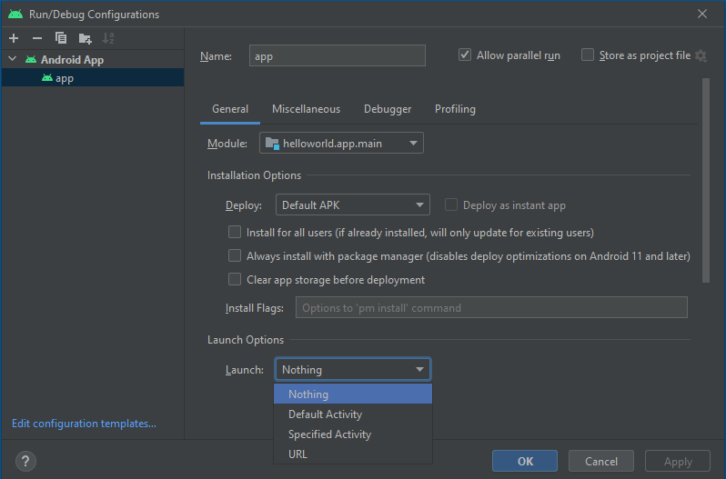
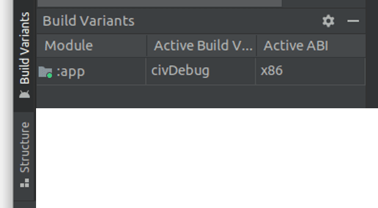
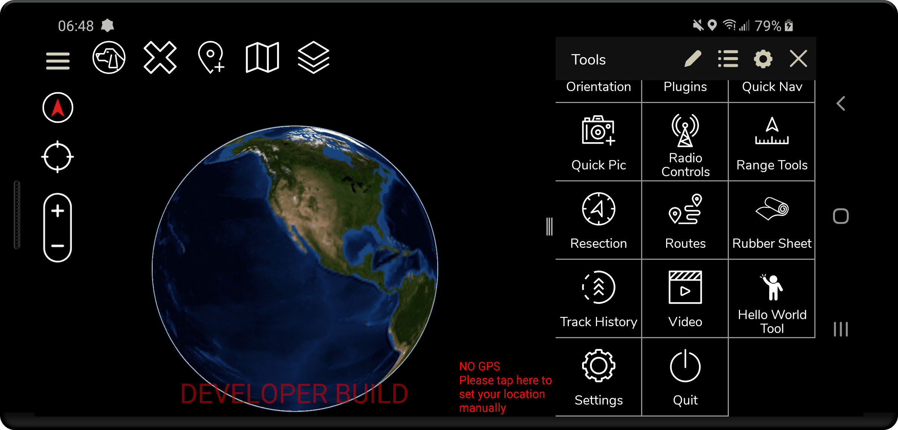
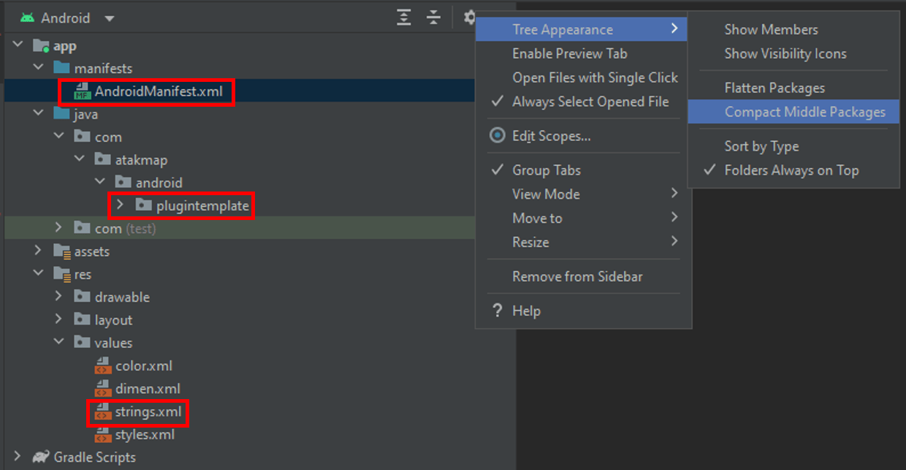

*Updated: 20 February 2023*

This section will cover how to run an existing ATAK Plugin and how to create your own ATAK Plugin from scratch (the provided template).


## Deploying / Running an ATAK Plugin

In order to deploy or run an ATAK plugin on your Android device you must have the following:

- Source code for the ATAK plugin you wish to install
- Android Studio setup on your device ([Completed "Setup for ATAK Development"](../android_studio_setup/))
- ATAK installed on your Android device ([Completed the section "Download ATAK-CIV and Install on Android Device"](../run_atak/#download-atak-civ-and-install-on-android-device-windows))
- ATAK SDK downloaded on your development machine ([Part of "Download ATAK-CIV and Install on Android Device"](../run_atak/))

Deploying and running ATAK plugins are generally particular to their location on your file system. What this means is that the template which most plugins are developed from require that the plugin's root folder is two directories below the SDK location. The following outlines how to structure your ATAK-CIV folder with additional plugins you wish to run. It does not matter what folder name you use to hold all of your plugins as long as it is in a `plugin` container folder placed at the same directory level as `main.jar`.

```python
atak-civ
|-- espresso
|-- learnatak   		# if you downloaded this repo place it here to use the demo plugins
	|-- demo-ai
	|-- demo-camera
	|-- demo-hello-world
	|-- doc
	└-- README.md
|-- plugin-examples
	|-- helloworld
	|-- plugintemplate
|-- plugins
	└-- <YOUR PLUGIN>	# your own plugins will go here 
|-- atak.apk
|-- ATAK_Plugin_Development_Guide.pdf
|-- ATAK_Plugin_Structure_Guide.pdf
|-- atak-gradle-takdev.jar
|-- atak-javadoc.jar
|-- LICENSE.txt
|-- main.jar
|-- mapping.txt
└-- VERSION.txt
```

When your plugin is located in your downloaded ATAK-CIV SDK directory, and you have the pre-requisites completed you can proceed to the following steps to deploy the plugin on your Android device. *Make sure you put the plugin in the `atak-civ` folder or the plugin will not run*

1. Open the Android plugin we want to run in Android Studio 
   A little Android Icon should be displayed in front of the root folder name to open the plugin as a project. For this demonstration we will open the `atak-civ/plugin-examples/helloworld` folder as an Android Studio Project.

   
   *If this is the first time you are attempting to run the program it is expected that the Gradle build will fail since there is a syntax issue in a `build.grade` file and the project requires signing keys in order to build successfully. Follow Steps 2 - 4 if the project fails to build.*
   
2. Open the `<PLUGIN-NAME>/app/build.gradle` file by set the *Project Files* view to "Project", expand the `app` directory and click the `build.gradle` file.
   On **line 16** there should be a line of code that we need to change since the `def` function is not properly scoped to be used later in the build script.

   ```groovy
   // app/build.gradle 
   // Original function signature
   def getValueFromPropertiesFile = { propFile, key ->
       
   // New function signature
   ext.getValueFromPropertiesFile = { propFile, key ->
   ```

3. Build the application signing keys which are required by the Android Operating System (OS) for security when installing software packages.
   At the bottom of the IDE there should be a *Terminal* tab you can open to launch a terminal session in the root folder of the plugin. 

   ```sh
   # Run the following commands in your Android Studio Terminal
   # Generate Debug signing key: set "alias", "keypass", and "storepass" flag values as desired
   keytool -genkeypair -dname "CN=Android Debug,O=Android,C=US" -validity 9999 -keystore debug.keystore -alias androiddebugkey -keypass android -storepass android 
   
   # Generate Release signing key: set "alias", "keypass", and "storepass" flag values as desired
   keytool -genkeypair -dname "CN=Android Release,O=Android,C=US" -validity 9999 -keystore release.keystore -alias androidreleasekey -keypass android -storepass android 
   ```

4. Edit the `<PLUGIN-NAME>/local.properties` file to add the following lines. 
   `<ANDROID_SDK_PATH>` and the `sdk.dir` should already be filled out by the IDE with the default Android SDK file path
   `<ABSOLUTE_PLUGIN_PATH>` should be a complete file path to the root plugin folder;
    example plugin path: `C\:\\tak\\atak-civ-sdk-4.5.1.13\\atak-civ\\plugin-examples\\helloworld` 

   ```ini
   # the sdk.dir should be automatically assigned to the path of your Android Studio SDK 
   sdk.dir=<ANDROID_SDK_PATH>  
   takDebugKeyFile=<ABSOLUTE_PLUGIN_PATH>\\debug.keystore
   takDebugKeyFilePassword=android
   takDebugKeyAlias=androiddebugkey
   takDebugKeyPassword=android
   
   takReleaseKeyFile=<ABSOLUTE_PLUGIN_PATH>\\release.keystore
   takReleaseKeyFilePassword=android
   takReleaseKeyAlias=androidreleasekey
   takReleaseKeyPassword=android
   ```
   *Double check that your file paths are correct for each keystore or the build will fail*
   
5. In the upper left corner, Go to `File > Project Structure` and click on the `SDK Location` tab. Click on the blue link to `Gradle Settings` and Make sure the 
   `Gradle JDK` for java is Java version `11`. If not, download Java Version 11 to use. If your Java version is too new or too old, the build will fail.

> **_NOTE:_** Do not upgrade gradle. In `File > Project Structure` on the `Project` tab, make sure the `Gradle Plugin Version` is 4.2.2 and then `Gradle Version` is 6.9.1 or other errors will arise

6. Build the application with the green hammer at the top.

   

   

7. Open the *Run Configurations* dropdown menu and select "Edit Configurations". A dialog like the one shown below should appear.
   The menu is located in the upper right toolbar to the left of the *Target Device menu* and the play button.

   

   
   
8. Set `Launch Options > Launch` dropdown selector to the value "Nothing" and press the *Apply* button.
   See the figure above for an example

9. Towards the bottom left, click on the `Build Variants` tab and change the `Active Build Variant` from `milDebug` to `civDebug`. 

   
   

10. If not already done, connect your Android device to your PC and ensure "USB for file transfer" is enabled. 

11. If not already done, launch the ATAK Application.

12. Click the *Play* button in Android Studio and check the "Plugins" menu in the side drawer and the plugin name should be listed. The image below shows the "Hello World Tool" loaded.




------


## Creating your own Plugin: First Steps

Prior to making a plugin you must have the following:

- Android Studio setup on your device ([Completed "Setup for ATAK Development"](../android_studio_setup/))
- ATAK SDK downloaded on your development machine ([Part of "Download ATAK-CIV and Install on Android Device"](../run_atak/))

The following file structure highlights the key areas we will be working within the ATAK-CIV downloaded files. For the remaining steps we will use the notation `<MY-PLUGIN>` to indicate where to place your plugin name. It is best not to have spaces in this name and use either `_`, `-`, or `CamelCase` to distinguish the words in the name of your plugin if it is more than one word.

```
atak-civ
|-- plugin-examples
	└-- plugintemplate
|-- plugins
	└-- <MY-PLUGIN>	 
...
```

Follow the steps below as a checklist of items every time you start developing a new plugin.

1. If not already done, create a `plugins` folder in the `atak-civ` folder.

2. Copy the `plugin-examples/plugintemplate` folder and paste the copy in the your custom `plugins` folder.
   You should now have a `/plugins/plugintemplate` folder at this point.

3. Rename the `/plugins/plugintemplate` folder to `plugins/<MY-PLUGIN>`

4. Open `plugins/<MY-PLUGIN>` in Android Studio.

5. Follow [steps 2 - 4 in the Deploying / Running an ATAK Plugin](#deploying--running-an-atak-plugin) to setup your plugins signing keys to allow it to build successfully.

  

 

   *Use the figure above as a reference for key files / packages that need to be changed to match your plugin*

6. In order to change your plugins package name to match your plugin name with the *Project Files* window open on the *Android* view. Click the gear *options* menu and under "Tree Appearance" make sure the "Compact Middle Packages" option is deselected.

7. Right click the `plugintemplate` package highlighted highlighted in the figure above and select `Refactor > Rename` and edit the name of the package. Best conventions is to use all lower case for the package with no underscores or dashes. Click the *Refactor* button for the changes to apply.

8. Everything except for the `AndroidManifest.xml` file (highlighted in the figure above) will be updated to use the new package. On line 3 edit the package name to reflect the new path.

   ```xml
   package="com.atakmap.android.<MY-PLUGIN>.plugin"
   ```

9. Now go to the `res/values/strings.xml` file and edit the `"app_name"` and `"app_desc"` to accurately reflect your plugin name and a description of what your plugin does.

10. At this point you should now be able to follow [steps 5- 9 in the Deploying / Running an ATAK Plugin](#deploying--running-an-atak-plugin) to view your plugin in ATAK to verify that everything modified from the template was done correctly.

### Refactor Template Core Components

Optionally you will probably want to `Refactor > Rename` the following classes to match your plugin name to reduce confusion for others examining your project's code. When renaming it is best practice to use CamelCase and only alter the sections of the name that match `PluginTemplate` as the last part of the class name corresponds to the ATAK Plugin component.

```
com.atakmap.android.<MY-PLUGIN>
|-- plugin
	|-- PluginTemplateLifecycle
	└-- PluginTemplateTool
|-- PluginTemplateDropDownReceiver
└-- PluginTemplateMapComponent
```

We will describe what these key components do to help you understand where to begin writing code for your plugin, but we recommend you checkout the `ATAK_Plugin_Structure_Guide.pdf` file in the ATAK-CIV download resources.

#### 1. ATAK Plugin Tool

Class: `plugin/PluginTemplateTool`
This is an optional component which is an entry in the ATAK toolbar. It allows the user to add an entry that can be used to perform and action on click such as launch the plug-in user interface (UI).

#### 2. ATAK Plugin Lifecycle

Class: `plugin/PluginTempalteLifecycle`
This is the main plugin entry point as it handles ATAK lifecycle callbacks and is used to load and initialize the main plug-in components like the `MapComponent`. Analogous to Android's `Application` class.

#### 3. ATAK Plugin MapComponent

Class: `PluginTemplateMapComponent`
This is the main component for the plug-in an is the building block for all activities within the system. This component sets up other UI components (such as `DropDownReceivers`), preferences and other high-level components. Analogous to an Android `Activity` class.

#### 4. ATAK Plugin Dropdown Receiver

Class: `PluginTemplateDropDownReceiver`
This is usually a container (usually a side panel) that can contain any standard Android Layout. Analogous to an Android `Fragment` class.

| ATAK Class                   | Similar Android Component(s)                                 |
| ---------------------------- | ------------------------------------------------------------ |
| `plugin.lifecycle.LifeCycle` | `Activity` (tide to [ATAK Main Activity](https://github.com/deptofdefense/AndroidTacticalAssaultKit-CIV/blob/03e312ecb5aaf54b948ec90bc5d6edfb7b7514b2/atak/ATAK/app/src/main/java/transapps/maps/plugin/lifecycle/Lifecycle.java)) |
| `DropDownMapComponent`       | `Activity` (tied to [ATAK Map FragmentActivity](https://github.com/deptofdefense/AndroidTacticalAssaultKit-CIV/blob/03e312ecb5aaf54b948ec90bc5d6edfb7b7514b2/atak/ATAK/app/src/main/java/com/atakmap/android/maps/MapComponent.java)) |
| `DropDownReceiver`           | `BroadcastReceiver` & `Fragment`                             |

## Setting up UI Layout 

In order to make sure your UI layouts work on all devices, create an emulated device so you can test you layouts on different screen sizes. Check out the [UI Layout](../../android_development/ui_layout_tutorial/) document for a list of different ways to organize your screen elements. 

## Filtering Logs

ATAK can produce an abundance of error log messages that can make it difficult to follow the Logcat especially when it comes to the map rendering engine running on verbose. You can use <kbd>Ctrl</kbd> + <kbd>space</kbd> to help auto complete and suggest when entering in filters.

```bash
# useful Filter to apply to LogCat to negate TAGs with high frequency errors that are not significant
package:com.atakmap.app.civ -tag:emuglGLESv2_enc -tag:chatty -tag:GLMapRenderer 
```

## Libraries included with ATAK Core (`main.jar`) 

You want to ensure any libraries you intend to use for your plugin don't conflict with the libraries that are already included in ATAK core, and you also don't want to import additional copies of these libraries in your plugin to minimize the size of the plugin. We provide a list of dependencies used in ATAK CIV 4.5.1.13 , but if you are using a different version of ATAK, follow the steps below to figure out the dependencies used in your version:

1. Extract the contents of `atak-civ/main.jar`. For unpackaging jar files on Windows we recommend [7-Zip](https://www.7-zip.org/download.html). Right click the jar in your file explorer and select the option `7-Zip > Extract to "main\"`.
2. Navigate into the extracted folder. If you followed our recommendation above, the folder with the `main.jar` will also have a `main/` folder.
3. Every file in the `main/META-INF/` folder will be of the format `*.version`. Everything before the version is the name of the library.
4. The content of each file holds the version number for the library

**ATAK-CIV 4.5.1.13 Dependencies **

| Package                                                | Version |
| ------------------------------------------------------ | ------- |
| `androidx.activity_activity`                           | `1.2.4` |
| `androidx.annotation_annotation-experimental`          | `1.0.0` |
| `androidx.arch.core_core-runtime`                      | `2.1.0` |
| `androidx.core_core`                                   | `1.2.0` |
| `androidx.customview_customview`                       | `1.0.0` |
| `androidx.exifinterface_exifinterface`                 | `1.3.3` |
| `androidx.fragment_fragment`                           | `1.3.6` |
| `androidx.lifecycle_lifecycle-livedata`                | `2.0.0` |
| `androidx.lifecycle_lifecycle-livedata-core`           | `2.3.1` |
| `androidx.lifecycle_lifecycle-process`                 | `2.3.1` |
| `androidx.lifecycle_lifecycle-runtime`                 | `2.3.1` |
| `androidx.lifecycle_lifecycle-viewmodel`               | `2.3.1` |
| `androidx.lifecycle_lifecycle-viewmodel-savedstate`    | `2.3.1` |
| `androidx.loader_loader`                               | `1.0.0` |
| `androidx.localbroadcastmanager_localbroadcastmanager` | `1.0.0` |
| `androidx.savedstate_savedstate`                       | `1.1.0` |
| `androidx.tracing_tracing`                             | `1.0.0` |
| `androidx.versionedparcelable_versionedparcelable`     | `1.1.0` |
| `androidx.viewpager_viewpager`                         | `1.0.0` |

## Additional Resources

The following links point to key areas within the ATAK project that a developer might consider looking at to gain more information about ATAK, the API, and plugins are integrated.

[ATAK Manifest to view permissions, activities and other details about the structure of ATAK.](https://github.com/deptofdefense/AndroidTacticalAssaultKit-CIV/blob/4.5.1.13/atak/ATAK/app/src/main/AndroidManifest.xml)

[Core of ATAK API if you want to view the source code and original documentation behind some of the core API methods.](https://github.com/deptofdefense/AndroidTacticalAssaultKit-CIV/tree/4.5.1.13/atak/ATAK/app/src/main/java/com/atakmap)

[Helpful README by ATAK Core development team with some useful Plugin information](https://github.com/deptofdefense/AndroidTacticalAssaultKit-CIV/blob/4.5.1.13/atak/README.md#plugins)

[If you have access to the TAK Gov website this is an additional resource to highlight build changes.](https://wiki.tak.gov/display/DEV/Changes+to+the+build+environment+for+4.5.X+from+4.4+and+4.3) Highlights about build settings for 4.5.X below:

- ATAK Core still supports minimum Android version 5.0 (API 21), but plugins can target newer versions of Android

- Build with Gradle 6.9.1 and Android Gradle 4.2.2 with R8 disabled. You set this in the `Project Structure > Project` within the IDE

- Dependencies provided by ATAK 4.5 core

  ```groovy
  implementation 'androidx.fragment:fragment:1.3.6'
  implementation 'androidx.exifinterface:exifinterface:1.3.3'
  implementation 'androidx.localbroadcastmanager:localbroadcastmanager:1.0.0'
  implementation 'androidx.lifecycle:lifecycle-process:2.3.1'
  ```

- The above provided core dependencies depend on `androidx.core.core:core:1.2.0` so in the case when a dependency you are using tries to include a different version of `androidx.core` it will likely crash ATAK with a error `missing saveAttributeDataForStyleable from a ViewCompat`. You could add something like the following to your plugin `build.gradle` file to make Gradle resolve to the proper 1.2.0 version.

  ```groovy
  configurations.all {
  	resolutionStrategy.eachDependency { details -> 
  		if (details.requested.group == 'androidx.core') {
  			details.useVersion "1.2.0"
  		}
  	}
  }
  ```

- `compileSdkVersion 30` & `targetSdkVersion 30`
